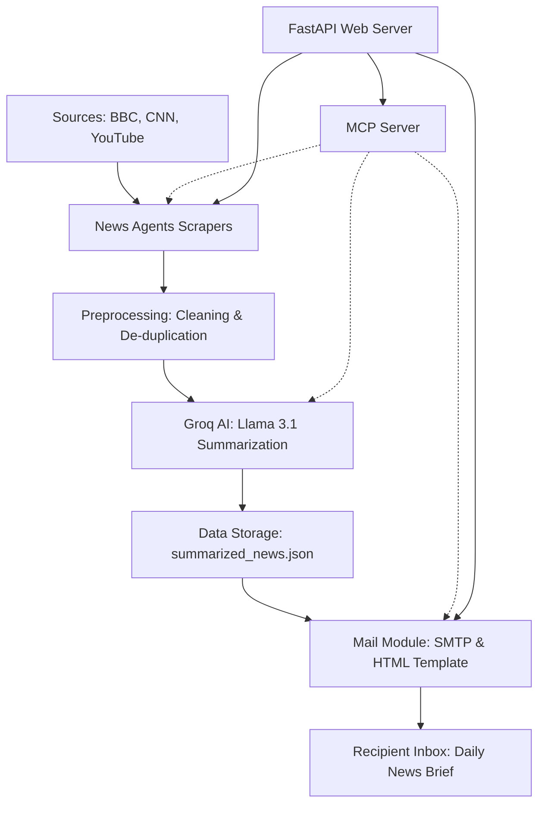

# AI-Powered Daily News Agent

This project is an automated AI news agent that aggregates, summarizes, and delivers a daily news brief to your email. It features a robust multi-source pipeline accessible via CLI, **FastAPI Web Controller**, and **MCP (Model Context Protocol)** for AI agentic integration.

## 🚀 How It Works

This project orchestrates a multi-step AI pipeline to transform raw news into a personalized daily brief.

### Architecture Flow



### Data Pipeline Stages

| Stage | Process | Technology |
| :--- | :--- | :--- |
| **Ingestion** | RSS Fetching, Web Scraping, Transcript Extraction | Python, Requests, BeautifulSoup, YT API |
| **Standardization** | Cleaning, Trimming, Deduplication | Custom Python Logic |
| **Summarization** | Intent-based 3rd-party summarization | Groq, Llama 3.1, LangChain |
| **Distribution** | HTML Formatting & SMTP Relay | Python `email.mime`, Gmail SMTP |
| **Web Interface** | RESTful Endpoints & Swagger Docs | FastAPI, Uvicorn |
| **Agent Interface** | Tool-based AI Interaction | FastMCP, Model Context Protocol |

1.  **Smart Aggregation**: 
    *   **Multi-Source Scraping**: Simultaneously pulls the latest stories from **BBC News** (RSS), **CNN** (Web Scraping), and **YouTube** (Transcript Extraction).
    *   **YouTube Intelligence**: Uses the `youtube-transcript-api` to "read" news videos from top global channels, allowing you to stay informed on video-first content.

2.  **Neural Preprocessing**:
    *   **Deduplication**: Automatically identifies and removes duplicate stories across different sources.
    *   **Content Optimization**: Cleans HTML noise and trims content to the optimal length for LLM processing without losing context.

3.  **AI Summarization Engine**:
    *   **Llama 3.1 Powered**: Leverages **Groq's** high-speed inference and **LangChain** to generate human-like, 3-4 line summaries.
    *   **LangSmith Tracing**: Every summary is traced via LangSmith for quality monitoring and performance debugging.

4.  **Automated Delivery**:
    *   **HTML Templating**: Articles are injected into a sleek, mobile-responsive HTML email template.
    *   **SMTP Cloud Send**: Dispatches the brief to your entire recipient list via Gmail's secure SMTP layer.

5.  **Agentic Interface (MCP)**:
    *   **Model Context Protocol**: The entire pipeline is exposed as a set of **MCP Tools**, allowing AI assistants (like Claude) to fetch, summarize, and email news on your behalf.

6.  **Web Control Center (FastAPI)**:
    *   **REST API**: Provides endpoints to manually trigger the pipeline, view raw news data, or inspect generated summaries.
    *   **Interactive Documentation**: Built-in Swagger UI allows for easy testing and monitoring of the news agent without a frontend.

## 📂 Project Structure

*   `main.py`: The entry point orchestrator that runs the entire pipeline.
*   `MCP/mcp_server.py`: Model Context Protocol (MCP) server for agentic interaction.
*   `FAST_API/api.py`: FastAPI web controller and background task runner.
*   `app.py`: Core AI summarization logic using Groq and LangChain.
*   `verify_setup.py`: diagnostic script to verify environment and API health.
*   `News_Agents/`: Specialized scrapers for BBC, CNN, and YouTube Transcripts.
*   `Preprocessing/`: Data cleaning, formatting, and deduplication logic.
*   `Mail_SMTP/`: Email templating and SMTP delivery system.
*   `summarized_news.json`: Local cache for generated news summaries.
*   `.agent/`: Workflows and automated instructions for AI pair-programming.

## 🛠️ Instructions to Run

### 1. Prerequisites
*   Python 3.10+ installed.
*   A **Groq API Key** (for the LLM).
*   A **LangChain API Key** (optional, for tracing).
*   A **Gmail App Password** (for sending emails).

### 2. Installation
1.  Clone the repository or download the files.
2.  Install the required dependencies:
    ```bash
    pip install -r requirements.txt
    ```

### 3. Configuration
1.  Rename `.env.example` to `.env` (if not already done).
2.  Open `.env` and fill in your details:
    ```ini
    GROQ_API_KEY=your_groq_api_key
    LANGCHAIN_TRACING_V2=true
    LANGCHAIN_API_KEY=your_langchain_api_key
    
    GMAIL_USER=your_email@gmail.com
    GMAIL_APP_PASSWORD=your_app_password
    RECIPIENT_EMAILS=person1@example.com,person2@example.com
    NEWSLENS_API_KEY=your_secret_key_here
    ```

### 4. Usage
Run the main script to trigger the full pipeline:

```bash
python main.py
```

### 5. MCP Server (AI Tools)
This project includes a Model Context Protocol (MCP) server that exposes the news agents as tools for AI assistants.

To run the MCP server:
```bash
python MCP/mcp_server.py
```

### 6. FastAPI Web Controller
You can also run a web-based control panel to trigger the pipeline or view news.

To run the API server:
```bash
python FAST_API/api.py
```
Then visit [http://127.0.0.1:8000/docs](http://127.0.0.1:8000/docs) to access the interactive Swagger UI.

Tools provided:
- `fetch_latest_news`: Triggers the scraping pipeline.
- `summarize_news_data`: Summarizes the scraped content.
- `send_news_brief_email`: Delivers the brief to your inbox.
